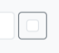
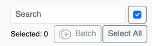
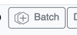
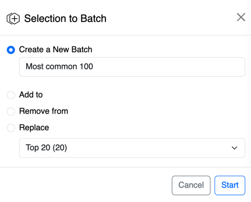
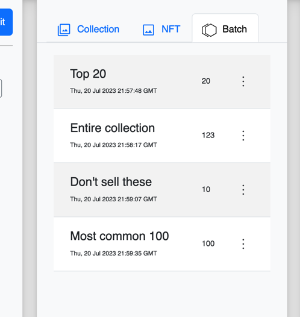

# Batches

## Batch Actions
With a batch of NFTs, you can call the following actions. 
- Select Items
- Mint NFTs
- [Create Offers](create-offers)
- Delete Batch

## Creating a Batch
Creating a batch involves selecting the NFTs you want and adding them to a batch.

1. Click the multi-select check box at the top of the NFT list.

The batch selection tools will appear below the search bar and the list of NFTs will become selectable.

4. Select the NFTs you want to include in the batch.

3. Click the **+ Batch** button.

The Batch selection view will appear.

Give your batch a name.

4. Click **Start** 
5. Go to the Batch tab to view your batches.

## List of Batches
Once you create a batch you can view it in the Batch tab.

