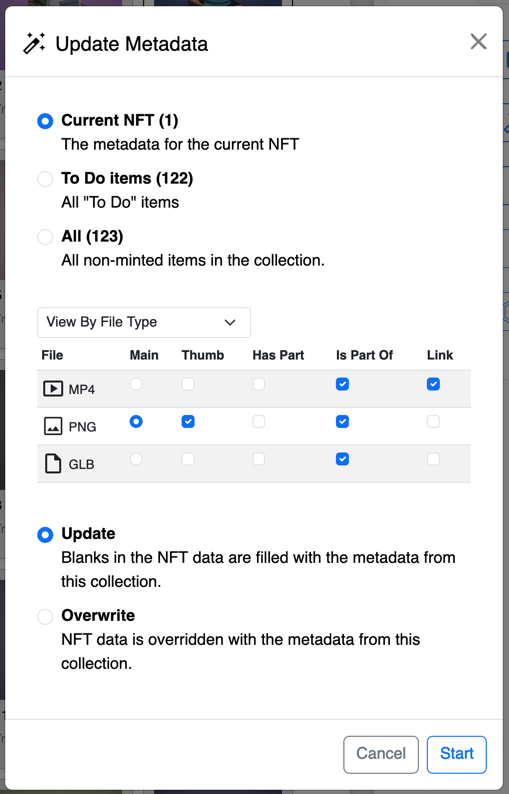
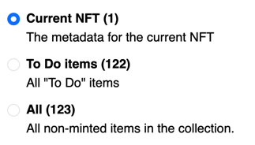
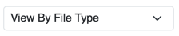
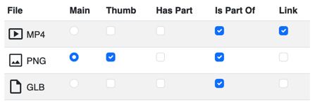
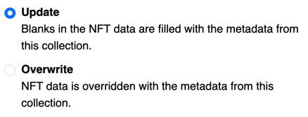

# Update Metadata
## Overview

Update Metadata is an important step in preparing your NFTs. 

Anytime you edit the collection's settings, you will need to run *Update Metadata* to make sure your changes are applied to every NFT.

Update Metadata will:
- Apply Collection settings to your NFTs
  - Collection Id, name, description, and links
  - NFT Defaults you may have set for NFT name, description, is sensitive, series number, series total and traits
  - Royalty, license, chia, and IPFS settings
- Apply roles for the different assets attached to your NFTs
- Apply the Series Number and Series Total values to each NFT

***Be sure to wait for the Update Metadata process to finish before you proceed.***

## How to start Update Metadata
You can run Update Metadata on the whole collection or a single NFT.

Click the Update Metadata button from the process tab for the collection or NFT.

The Update Metadata view will appear.

## Update Metadata view

## Update Metadata options
### Scope of changes

Choose which NFTs you want to update.
- **Current NFT** is only visible if you click Update Metadata for a single NFT
- **To Do Items** will apply changes to only the items marked "To Do"
- **All** will apply changes to everything that hasn't been minted yet.

### File Grouping

Choose how to group your files, so that the Asset Role choices can be applied to a similar type.
- **View Single Files** will show all the files in your collection. This makes more sense for smaller collections.
- **View By File Type** will show all the file types in your collection. This is helpful for collections with only one file per file type.
- **View By File Name Groups** will show all the files with identical file names in groups. Name Groups allow you to set different options for each variation of a file. For example, if you have three WebP files at different resolutions which corresponding names. For more about Name Groups, read about [preparing your files](/docs/details/file-prep).
### Asset Roles 

Choose how your assets will be used in your NFTs.
- **Main** is required for each NFT. The main asset should be the primary file. 
*At the time of writing this, it's a good idea for this to be an image or video, because it will look better in explorers and the Chia wallet. Once apps have adopted the CHIP-0015 standard, this will be less of an issue.*
- **Thumb** should be used for images that will be used by apps to display the image. You can have as many thumb images you want. Supplying thumbs of different sizes will help apps choose the best one for the size they need.
- **Has Part / Encodes** Select if the file is contained within the main asset
  - A layer of an image, that isn't the whole image would have Has Part selected.
  - A vocal part of a song (main asset) would have Has Part selected.
- **Is Part Of / Associated** - Select if the file contains the main asset
  - An image that is the same as the main asset, but in a different file format.
  - A music video that contains a song (main asset)
- **Link** - Select if you want the URL to the asset to be added to the NFT's attributes, which are visible NFT details of most apps. This allows users to visit the link without viewing the metadata to find it.

### Editing Permissions

Choose how changes will be applied.
- **Update** - Only blank fields for each NFT are filled. Completed values are left alone.
- **Overwrite** - All NFT fields are overwritten by the current values of the collection. 
