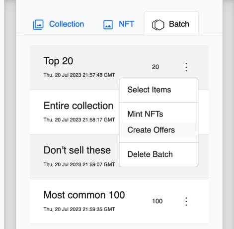
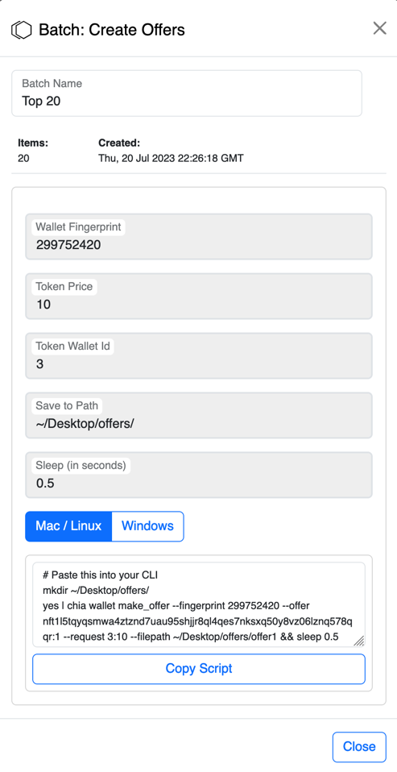

# Create Offers
You can create batches for minted NFTs. To import minted NFTs, first download a minted collection. 

## Create a batch of NFTs
Offers are managed in batches. This allows you to create selections of NFTs and set different offer prices for each.

To create offers, first [create a batch of NFTs](batches).

## Use the batch of NFTs
Go to the Batch tab and click the dot menu for the batch of NFTs you want to create offers for.

The "Batch: Create Offers" view will appear.

## Batch: Create Offers

Create offers with the Chia app and the command line interface (CLI). This can be done by pasting the script provided into your terminal.

Refer to [Chia's Offers tutorial (CLI)](https://docs.chia.net/guides/offers-cli-tutorial) for more.

*Currently, Mintr Beta doesn't have a WalletConnect solution.*
